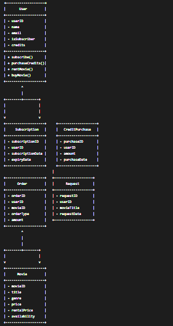

# online-film-store

Online film satan veya kiralayan bir uygulama için sınıf diyagramı tasarlarken, sistemdeki temel varlıkları ve bunlar arasındaki ilişkileri modellememiz gerekiyor. Aşağıdaki sınıflar ve ilişkiler bu sistemi oluşturan temel yapı taşlarını oluşturacaktır:

Sınıflar ve İlişkiler
User (Kullanıcı) Sınıfı:

Özellikler: userID, name, email, isSubscriber (abonelik durumu), credits (kredi miktarı)
İlişkiler: Bir kullanıcı bir veya daha fazla Order (Sipariş) ve Request (Talep) yapabilir.
Movie (Film) Sınıfı:

Özellikler: movieID, title, genre, price, rentalPrice (kira bedeli), availability (mevcutluk durumu)
İlişkiler: Bir film bir veya daha fazla Order ile ilişkilendirilebilir.
Order (Sipariş) Sınıfı:

Özellikler: orderID, userID, movieID, orderType (satın alma veya kiralama), amount (tutar)
İlişkiler: Bir sipariş bir kullanıcıya ve bir filme aittir.
Subscription (Abonelik) Sınıfı:

Özellikler: subscriptionID, userID, subscriptionDate, expiryDate
İlişkiler: Bir abonelik bir kullanıcıya aittir.
CreditPurchase (Kredi Satın Alma) Sınıfı:

Özellikler: purchaseID, userID, amount, purchaseDate
İlişkiler: Bir kredi satın alma işlemi bir kullanıcıya aittir.
Request (Talep) Sınıfı:

Özellikler: requestID, userID, movieTitle, requestDate
İlişkiler: Bir talep bir kullanıcıya aittir.

Sınıf Diyagramı Taslağı

Açıklama:
User: Kullanıcıların temel bilgilerini ve kredi miktarlarını içerir. Abonelik, kredi satın alma, film kiralama ve satın alma işlemleri için metotlar içerir.
Movie: Filmlerin temel bilgilerini içerir.
Order: Satın alma ve kiralama işlemlerini temsil eder.
Subscription: Kullanıcı abonelik bilgilerini içerir.
CreditPurchase: Kullanıcıların kredi satın alma işlemlerini içerir.
Request: Kullanıcıların mevcut olmayan filmleri talep etme işlemlerini içerir.
Bu diyagram, sistemin temel bileşenlerini ve bunlar arasındaki ilişkileri gösterir. Polimorfizm, Order sınıfında orderType özelliği kullanılarak (satın alma veya kiralama) ve User sınıfında isSubscriber özelliği ile abonelik durumu belirlenerek sağlanabilir.

